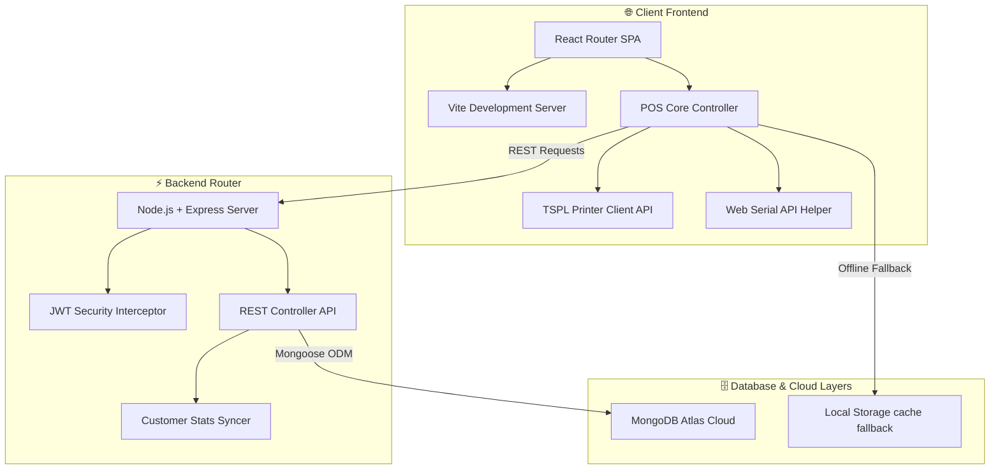

# 🚀 GenZ Laundry & Dry Cleaners
### *Enterprise Billing, Tagging & Business Ledger Management System*

<div align="center">

[](https://react.dev/)
[](https://nodejs.org/)
[](https://www.mongodb.com/)
[](https://www.typescriptlang.org/)
[](https://vite.dev/)

**A premium web-based POS billing system with integrated thermal printing, clothing tag alignment calibration, dynamic UPI QR payments, and business accounting ledger.**

[🌐 Live Application](https://billing.genzlaundry.com) • [🚀 Quick Start](#-quick-start) • [⚡ Architecture](#-system-architecture) • [🔧 Setup Guides](#-local-installation)

</div>

---

## ⚡ Recent Innovations (Last Month Updates)

We have upgraded the POS billing platform with modern business automation, high-fidelity thermal receipt templates, and streamlined admin operations:

### 1. 🎛️ Scroll-Free Admin Overlay Experience
* **Fixed Modal Popup Overlay**: Refactored the Add/Edit forms for both **Expenses** (`ExpenseManager.tsx`) and **Bills** (`BillManager.tsx`) into viewport-centered modal overlays with a blurred backdrop filter (`backdrop-filter: blur(8px)`). Admins no longer need to scroll up to make edits.
* **Particular Item Editor**: Inside the Edit Bill modal, admins can now edit individual items on a bill. You can modify item names, rates, and quantities, delete items, or add new items on the fly. The subtotal and grand total are re-computed dynamically.

### 2. 🧾 Order Deposit Receipt System
* **Specialized Delivery Workflows**: Created a side-by-side print action in the POS interface (**PRINT BILL** vs **ORDER RECEIPT**).
* **Payment Deposit Logs**: Generates and prints advanced deposit receipts specifying estimated pickup dates, service levels (e.g. Wash Only, Iron Only, Wash & Iron, Dry Clean), and advance payments made with specified methods (Cash, UPI, Card).

### 3. 🏷️ Direct TSPL Printing & Offset Calibration
* **Direct Server Bypass**: Integrated a direct print route to a local thermal print server (`http://localhost:3001/api/print/tspl-tags`) allowing direct TSPL instruction delivery to the **TSC TL240** clothing tag printer, bypassing browser dialogs.
* **Dot Alignment Slider**: Embedded a live shift-dots offset slider directly in the frontend interface (adjusting alignment from `-100` to `+100` dots) to perfectly calibrate the print position on continuous 37mm x 40mm tag rolls.

### 4. 🧾 Entry History Search & Lookup
* **Receipt History Viewer**: Added a dedicated **🧾 Order Receipts** tab inside the "Entry" modal overlay.
* **Instant Keyword Lookup**: Admins can query receipts by customer name, phone prefix, or order number, with quick-actions to re-print receipts or purge records.

### 📱 Universal Country Code Picker
* Flanked customer phone fields with a compact country code selector dropdown to support international customers, ensuring cleaner SMS API payloads.

---

## ✨ System Features

### 🛒 Point of Sale & Smart Billing
* **Dynamic UPI QR Code Generator**: Renders customized UPI payment request QR codes matching the bill's exact grand total and order metadata. Compatible with PhonePe, GPay, Paytm, and BHIM.
* **Monochrome Thermal Receipts**: Custom CSS styles optimized for 58mm/80mm thermal receipt printers with crisp borders, tabular layouts, and clear font hierarchy.
* **Points & Customer CRM**: Tracks customer loyalty points and previous unpaid balance.

### 📊 Financial Ledger & Expense Tracker
* **Operating Cost Manager**: Track utilities, rent, shop expenses, and staff wages.
* **Capital Investments Ledger**: Record capital investments and partner contributions.
* **Money Given Out**: Track outstanding employee advances and loans with detailed return histories.
* **Real-time Overview Analytics**: Automatically computes total revenue, total capital, total expenses, outstanding loans, and net balances with animated KPIs.

---

## 🏗️ System Architecture

The application is structured as a decoupled SPA (Single Page Application) communication framework:


```mermaid
graph TB
    subgraph "🌐 Client Frontend"
        A[React Router SPA] --> B[Vite Development Server]
        A --> C[POS Core Controller]
        C --> D[TSPL Printer Client API]
        C --> E[Web Serial API Helper]
    end
    
    subgraph "⚡ Backend Router"
        F[Node.js + Express Server] --> G[JWT Security Interceptor]
        F --> H[REST Controller API]
        H --> I[Customer Stats Syncer]
    end
    
    subgraph "🗄️ Database & Cloud Layers"
        J[MongoDB Atlas Cloud]
        K[Local Storage cache fallback]
    end
    
    C -->|REST Requests| F
    H -->|Mongoose ODM| J
    C -->|Offline Fallback| K
```

---

## 🚀 Local Installation

### Prerequisites
* **Node.js** v18.0 or higher
* **MongoDB** v6.0 or higher (or a MongoDB Atlas connection string)
* **Git** installed on your system

### Step 1: Clone the Project
```bash
git clone https://github.com/GenZLaundry/GenZBilling.git
cd GenZBilling
```

### Step 2: Install Dependencies
Install modules for both the frontend client and backend API server:
```bash
# Install frontend packages
npm install

# Install backend packages
cd server
npm install
cd ..
```

### Step 3: Environment Files Config
Create a `.env` file in the `server` directory:
```env
# server/.env
MONGODB_URI=mongodb://localhost:27017/genz_laundry
PORT=8000
NODE_ENV=development
CORS_ORIGIN=http://localhost:5173
JWT_SECRET=your-super-secure-jwt-key
DEFAULT_UPI_ID=6367493127@ybl
```

Create a `.env.production` file in the root directory for building the client application:
```env
# /.env.production
VITE_API_BASE_URL=https://billing.genzlaundry.com/api
```

### Step 4: Start the Services

#### Start the Server API:
```bash
cd server
npm run dev
```

#### Start the React Frontend Web Application (in a new terminal):
```bash
# from root folder
npm run dev
```
Open **`http://localhost:5173`** to access the system interface.

---

## 📡 API Endpoints Reference

### 🔐 Auth Service
* `POST /api/auth/login` - Administrator login credentials verification
* `POST /api/auth/verify` - Check current active JWT session validity

### 🧾 Billing Database API
* `GET /api/bills` - Fetch billing transactions with query filters (name, phone, status)
* `POST /api/bills` - Create new bill record
* `PUT /api/bills/:id` - Update customer details, totals, and item details on a bill
* `DELETE /api/bills/:id` - Purge a bill transaction from database
* `PATCH /api/bills/payment/:billNumber` - Record partial/deposit payment on an active bill

### 💸 Ledger Expense API
* `GET /api/expenses` - Retrieve list of operational expense entries
* `POST /api/expenses` - Log a new store expense record
* `PUT /api/expenses/:id` - Edit description, cost, or category of an expense entry
* `DELETE /api/expenses/:id` - Remove store expense log

---

## 🖨️ Clothing Tag Thermal Printer Server Configuration

If you are using the TSC TL240 printer with TSPL commands for tag printing, run the local helper print server:

```bash
# Navigate to printing server
cd thermal-print-server
npm install
npm start
```
This launches a lightweight background printing server at `http://localhost:3001` which communicates directly with the local printer queue using `printer` system library bindings, offering instant high-speed label prints.

---

## 🤝 Contributing

We welcome contributions to optimize the GenZ Laundry ecosystem:
1. Fork the Repository
2. Create your Feature Branch (`git checkout -b feature/AmazingFeature`)
3. Commit your Changes (`git commit -m 'Add some AmazingFeature'`)
4. Push to the Branch (`git push origin feature/AmazingFeature`)
5. Open a Pull Request

---

## 📄 License

This software is distributed under the **MIT License**. Check out the `LICENSE` file for detailed legal permissions.

---
**🏆 Created with ❤️ for the Laundry & dry cleaning service industry.**